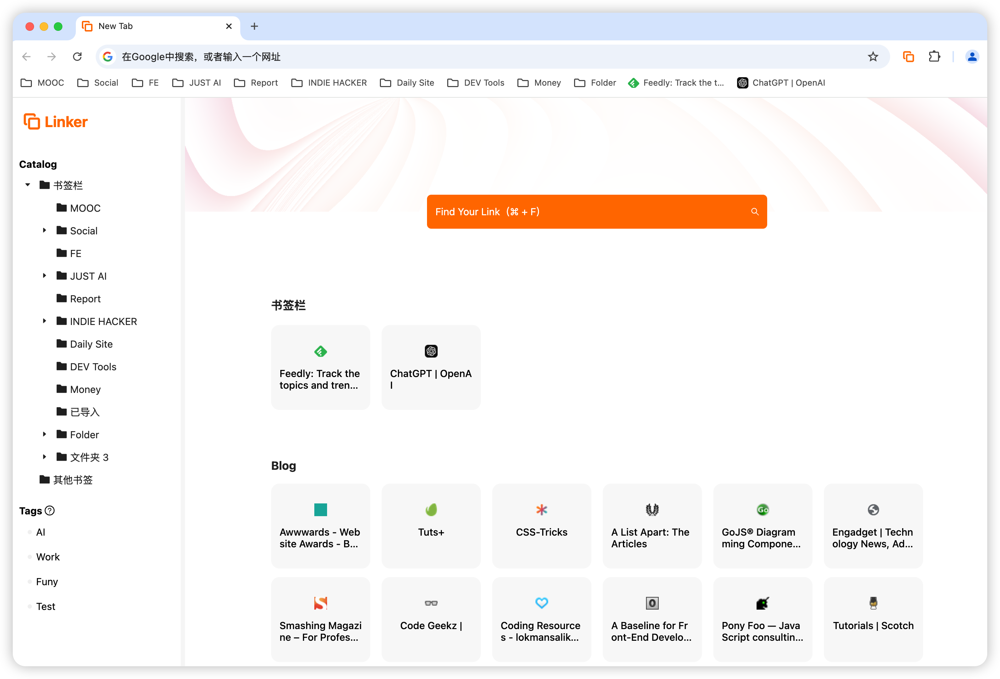
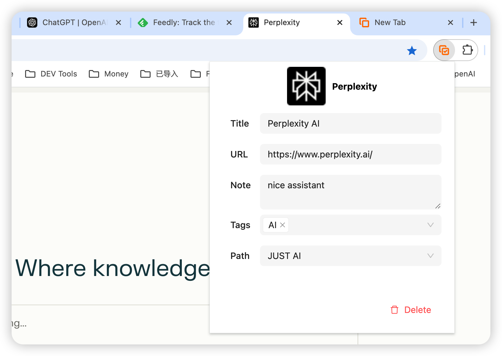

# Linker

AI reshapes bookmark management and new tab page experience

## Features

- Replace your newTab page with bookmarks
- Support adding tags and descriptions when saving bookmarks
- Support two-way synchronization of bookmarks and Chrome bookmarks modifications
- Support fast search bookmarks

## TODO

- AI automatically annotates website types, eliminating the need for manual processing
- Automatically decide whether to save bookmarks based on browsing situation
- Automatically categorize and label bookmarks based on AI

## Development

To start the development server, run `npm start`. This will start a local server at `http://localhost:3000` where you can view the application in your browser. Any changes you make to the code will be automatically refreshed in the browser.

## TOOLS

- **Icon Resizer**: https://hotpot.ai/icon-resizer
  - Use this tool to resize icons for your project.

- **Logo Design**: https://logofa.st/
  - If you need a logo for your project, check out this website.
